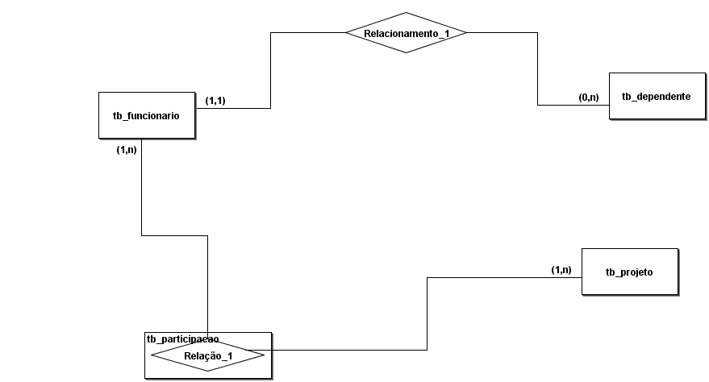

# RELAÇÃO ENTRE TABELAS

## TABELAS QUE SERÃO UTILIZADAS DE EXEMPLO



## CRIAÇÃO DO BANCO DE DADOS

```SQL
CREATE DATABASE IF NOT EXISTS tb_empresa;
```

## SELEÇÃO PARA USO DO BANCO DE DADOS

```SQL
USE db_empresa;
```

## CRIAÇÃO DA TABELA FUNCIONÁRIO

```SQL
CREATE TABLE tb_funcionario(
    id_funcionario INT PRIMARY KEY AUTO_INCREMENT,
    nome VARCHAR(125),
    cargo VARCHAR(125)
);
```

## CRIAÇÃO DA TABELA DEPENDENTE

```SQL
CREATE TABLE tb_dependente(
    id_dependente INT PRIMARY KEY AUTO_INCREMENT,
    dependente VARCHAR(125)
);
```

## COMANDOS PARA AUXÍLIO

```SQL
SHOW TABLES;
DESC tb_funcionario;
DESC tb_dependente;
```

## ALIMENTANDO AS TABELAS

```SQL
INSERT INTO tb_funcionario VALUES
(1, 'João Pedro', 'Analista'),
(2, 'Joana Silva', 'Analista');

INSERT INTO tb_dependente VALUES
(1, 'Pedrinho'),
(2, 'Pedrinha');
```
## VERIFICANDO AS TABELAS PREENCHIDAS

```SQL
SELECT * FROM tb_funcionario;
SELECT * FROM tb_dependente;
```

## ACRESCENTANDO A COLUNA QUE RECEBERÁ A CHAVE ESTRANGEIRA

```SQL
ALTER TABLE tb_dependente
ADD COLUMN id_funcionario INT;
```

## INFORMANDO QUAL SERÁ CHAVE ESTRANGEIRA NA COLUNA CRIADA

```SQL
ALTER TABLE tb_dependente
ADD FOREIGN KEY (id_funcionario)
REFERENCES tb_funcionario (id_funcionario);
```

## ALIMENTANDO A COLUNA FK DA TABELA DEPENDENTE COM A PK DA TABELA FUNCIONÁRIO

```SQL
UPDATE tb_dependente
SET id_funcionario = '1'
WHERE id_dependente IN ('1','2');
```

## ADICIONANDO MAIS UM DEPENDENTE

```SQL
INSERT INTO tb_dependente (nome) VALUES
('Joaninha');
```

## ALIMENTANDO A COLUNA FK DA TABELA DEPENDENTE COM A PK DA TABELA FUNCIONÁRIO

```SQL
UPDATE tb_dependente
SET id_funcionario = '2'
WHERE id_dependente = '3'
```

## CRIAÇÃO DA TABELA PARTICIPAÇÃO

```SQL
CREATE TABLE tb_participacao(
    id_participacao INT PRIMARY KEY AUTO_INCREMENT,
    id_projeto INT NOT NULL,
    id_funcionario INT NOT NULL,
    data_inicio DATE,
    data_fim DATE,
    FOREIGN KEY (id_projeto) REFERENCES tb_projeto (id_projeto),
    FOREIGN KEY (id_funcionario) REFERENCES tb_funcionario (id_funcionario),
    UNIQUE (id_projeto, id_funcionario)
);
```

## EXIBIR TABELAS

```SQL
SHOW TABLES;
```

## ALIMENTANDO A TABELA PROJETO

```SQL
INSERT INTO tb_projeto (nome, descricao) VALUES
('Projeto A', 'Iniciando o projeto A'),
('Projeto B', 'Iiniciando o projeto B');
```

## EXIBINDO OS DADOS INSERIDOS

```SQL
SELECT * FROM tb_projeto;
```

## ALIMENTANDO A TABELA PARTICIPAÇÃO

```SQL
INSERT INTO tb_participacao
    (id_participacao, id_projeto, id_funcionario, data_inicio, data_fim),
VALUES
    (1, 1, 1, '2024-05-05', '2024-06-05'),
    (2, 1, 2, '2024-05-05', '2024-06-05');
```

## EXIBINDO OS DADOS INSERIDOS

```SQL
SELECT * FROM tb_participacao;
```

## INSERINDO NOVO REGISTRO NA TABELA PARTICIPAÇÃO

```SQL
INSERT INTO tb_participacao
    (id_participacao, id_projeto, id_funcionario, data_inicio, data_fim)
VALUES
    (3, 1, 1, '2024-05-05', '2024-06-05');
```

[Página Inicial](../README.md)
