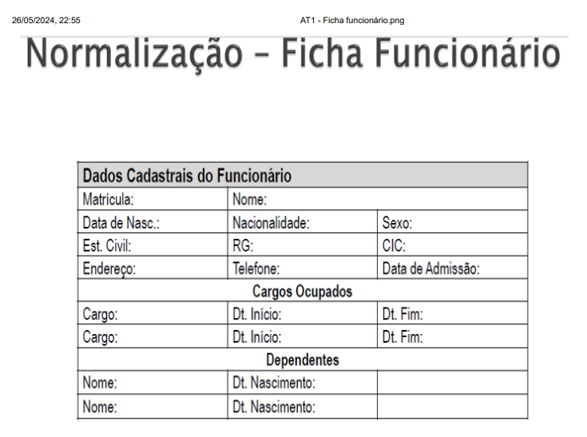

# ATIVIDADE DE FIXAÇÃO DE RELACIONAMENTO ENTRE TABELAS

## Ficha referência

A partir da ficha abaixo, crie os modelos conceituais e lógico e, em seguida, crie as tabelas no MySQL Workbench

[Página Inicial](../README.md)
