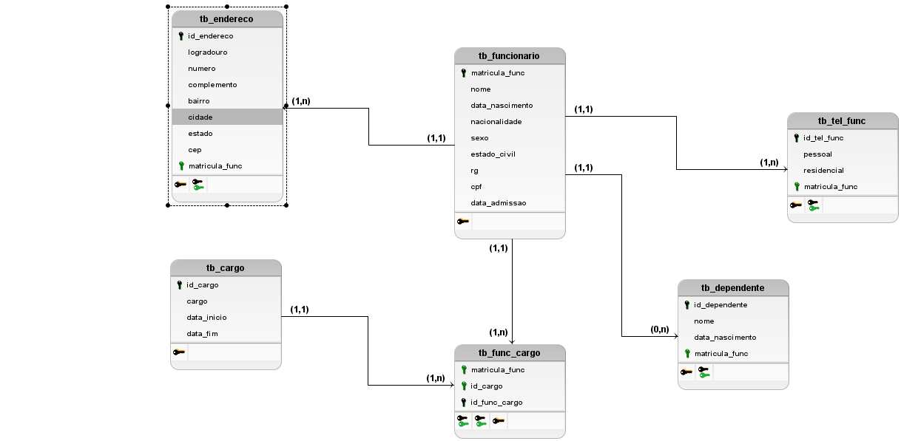

# ATIVIDADE DE FIXAÇÃO DE RELACIONAMENTO ENTRE TABELAS

## Ficha referência

A partir da ficha abaixo, crie os modelos conceitual e lógico e, em seguida, crie as tabelas no MySQL Workbench


## Criando e selecionando o banco de dados para uso

```SQL
CREATE IF NOT EXISTS db_firma02;
USE db_firma02;
```

## Exibindo os modelos

Modelo Conceitual


Modelo Lógico



## Criação das tabelas

```SQL
-- Tabela 01 de 05
CREATE TABLE IF NOT EXISTS tb_cargo(
    id_cargo INT PRIMARY KEY AUTO_INCREMENT,
    cargo VARCHAR(125)
);

-- Tabela 02 de 05
CREATE TABLE IF NOT EXISTS tb_endereco(
    id_endereco INT PRIMARY KEY AUTO_INCREMENT,
    logradouro VARCHAR(125),
    número VARCHAR(15),
    complemento VARCHAR(125),
    cidade VARCHAR(125),
    estado VARCHAR(125),
    cep VARCHAR(10)
);

-- Tabela 03 de 05
CREATE TABLE IF NOT EXISTS tb_tel_func(
    id_tel_func INT PRIMARY KEY AUTO_INCREMENT,
    pessoal VARCHAR(15),
    residencial VARCHAR(15)
);

-- Tabela 04 de 05
CREATE TABLE IF NOT EXISTS tb_funcionario(
    matricula_func INT PRIMARY KEY AUTO_INCREMENT,
    nome VARCHAR(125),
    data_nascimento DATE,
    nacionalidade VARCHAR(125) DEFAULT 'Brasileira',
    sexo ENUM ('F', 'M'),
    estado_civil ENUM ('Casada(o)', 'Divorciada(o)', 'Separada(o)', 'Solteira(o)', 'Viúva(o)'),
    rg VARCHAR(45)
    CPF VARCHAR(20)
    id_endereco INT NOT NULL,
    id_tel_func INT NOT NULL,
    FOREIGN KEY (id_endereco) REFERENCES tb_endereco (id_endereco),
    FOREIGN KEY (id_tel_func) REFERENCES tb_tel_func (id_tel_func)
);

-- Tabela 05 de 05
CREATE TABLE IF NOT EXISTS tb_dependente(
    id_dependente INT PRIMARY KEY AUTO_INCREMENT,
    nome VARCHAR(125),
    data_nascimento DATE,
    id_func INT,
    FOREIGN KEY (id_func) REFERENCES tb_funcionario (id_funcionario)
);
```
## Exibindo as estruturas das tabelas criadas

```SQL
DESC tb_cargo;
DESC tb_endereco;
DESC tb_tel_func;
DESC tb_func;
DESC tb_dependente;
```

[Página Inicial](../README.md)
